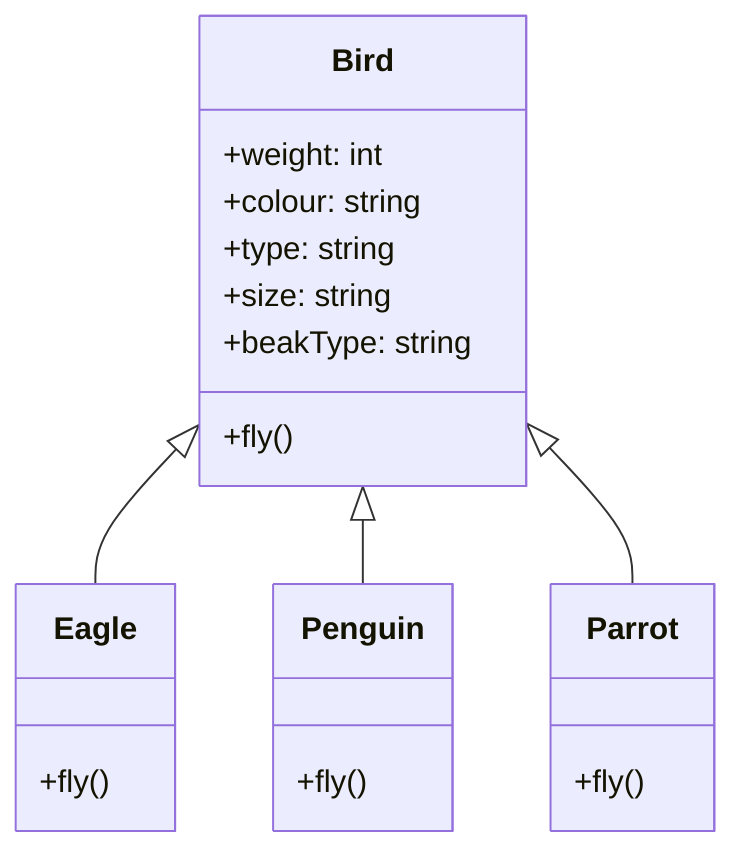
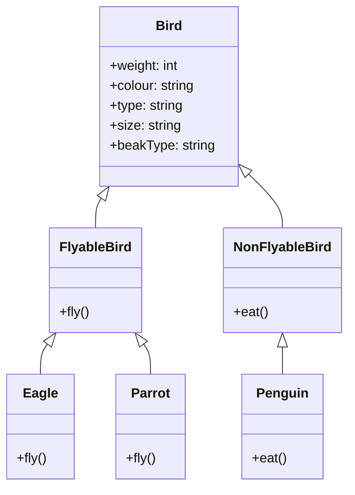
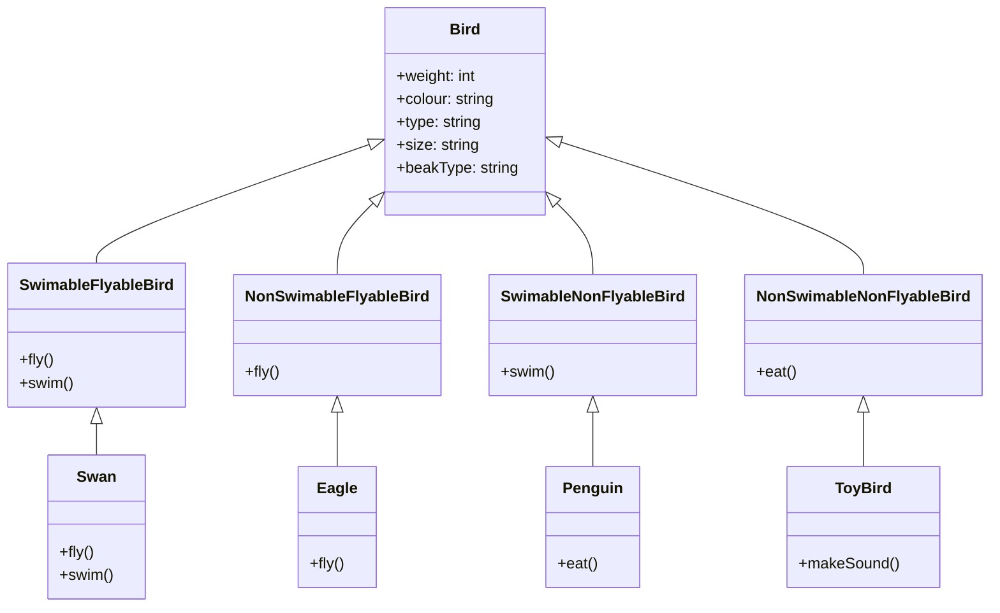
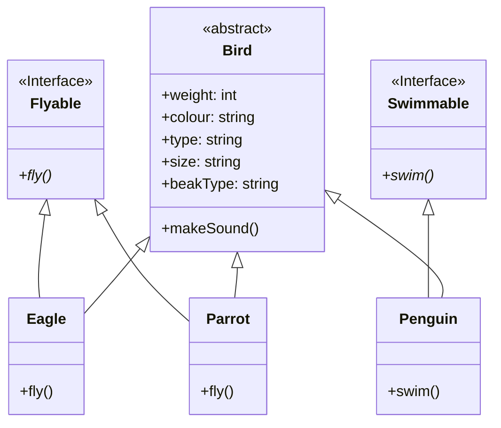
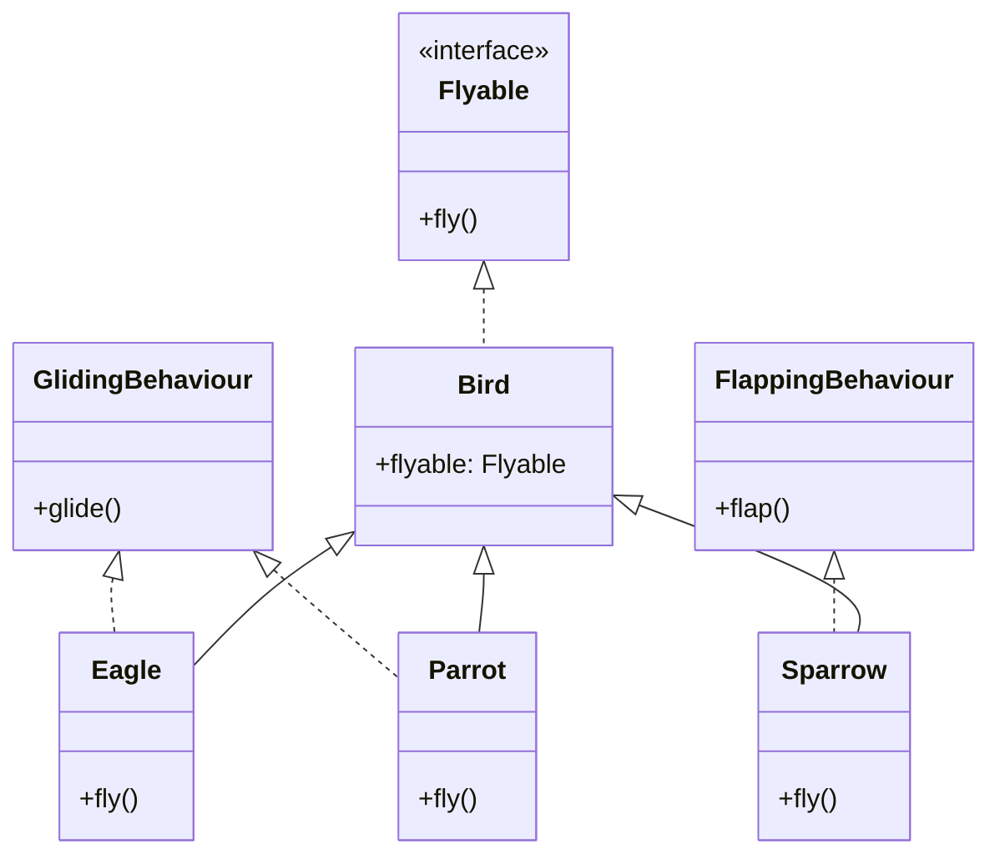
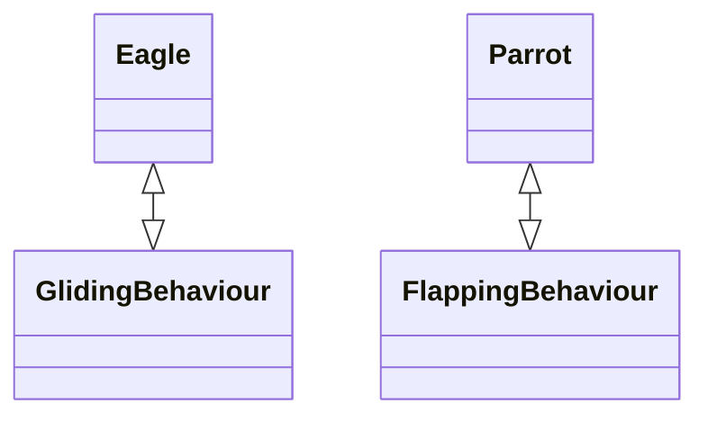
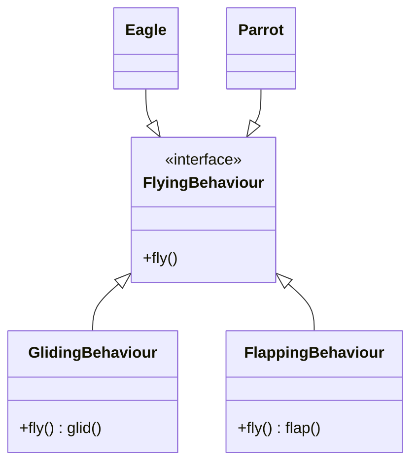

# SOLID principles - Liskov, Interface Segregation, and Dependency Inversion

## Key Terms
### Liskov Substitution Principle
> Objects in a program should be replaceable with instances of their subtypes without altering the correctness of that program.

### Interface Segregation Principle
> Many client-specific interfaces are better than one general-purpose interface.

### Dependency Inversion Principle
> Depend upon abstractions. Do not depend upon concrete classes.

## Liskov Substitution Principle

Let us take a look at our final version of the `Bird` class from [the last session](https://github.com/kanmaytacker/fundamentals/blob/master/oop/notes/04-solid-01.md#fixing-ocp-violation-in-the-bird-class). We started with a `Bird` class which had SRP and OCP violations. We now have a `Bird` abstract class which can be extended by the `Eagle`, `Penguin` and `Parrot` subclasses.



We have also added a `fly()` method to the `Bird` class. All the subclasses of `Bird` have to implement this method. **A penguin cannot fly, yet we have added a `fly()` method to the `Penguin` class. How can we handle this?**
* `Dummy method` - We can add a dummy method to the `Penguin` class which does nothing.
* `Return null`
* `Throw an exception`

In the above methods, **we are trying to force a contract on a class which does not follow it. If we try to use a `Penguin` object in a place where we expect a `Bird` object, we could have unexpected outcomes**. For example, if we call the `fly()` method on a `Penguin` object, we would get an exception. This is not what we want. We want to be able to use a `Penguin` object in a place where we expect a `Bird` object. We want to be able to call the `fly()` method on a `Penguin` object and get the same result as if we had called it on a `Sparrow` object. This is where the Liskov Substitution Principle comes into play.

```java
List<Bird> birds = List.of(new Eagle(), new Penguin(), new Parrot());
for (Bird bird : birds) {
    bird.fly();
}
```
This is a violation of the Liskov Substitution Principle. _The Liskov Substitution Principle states that objects in a program should be replaceable with instances of their subtypes without altering the correctness of that program_. In other words, if we have a `Bird` object, we should be able to replace it with an instance of its subclasses without altering the correctness of the program. In our case, we cannot replace a `Bird` object with a `Penguin` object because the `Penguin` object requires special handling. **PS : No Special treatment to subClass(es)**


### Creating new abstract classes

A way to solve the issue with the `Penguin` class is to create a new set of abstract classes, `FlyableBird` and `NonFlyableBird`. The `FlyableBird` class will have the `fly()` method and the `NonFlyableBird` class will not have the `fly()` method. **The `Penguin` class will extend the `NonFlyableBird` class and the `Eagle` and `Parrot` classes will extend the `FlyableBird` class.** This way, we can ensure that the `Penguin` class does not have to implement the `fly()` method.



This is an example of multi-level inheritance. The **issue** with the above approach is that we are **tying behaviour to the class hierarchy**. If we want to **add a new type of behaviour**, we will have to **add a new abstract class**. For instance if we can have birds that can swim and birds that cannot swim, we will have to create a new abstract class `SwimableBird` and `NonSwimableBird` and add them to the class hierarchy. But now how do you **extends from two abstract classes? You can't**. Then we would have to create classes with composite behaviours such as `SwimableFlyableBird` and `SwimableNonFlyableBird`.



If we want to add a new type of behaviour, we will have to add a new abstract class. This is why we should not tie behaviour to the class hierarchy.

### Creating new interfaces

We can solve the issue with the `Penguin` class by creating new interfaces. We can create an `Flyable` interface and an `Swimmable` interface. **The `Penguin` class will implement the `Swimmable` interface and the `Eagle` and `Parrot` classes will implement the `Flyable` interface. This way, we can ensure that the `Penguin` class does not have to implement the `fly()` method.**



Since we are not tying behaviour to the class hierarchy, we can add new types of behaviour without having to add new abstract classes. For instance, if we want to add a new type of behaviour, we can create a new interface `CanSing` and add it to the class hierarchy.

### Summary
* The Liskov Substitution Principle states that objects in a program should be replaceable with instances of their subtypes without altering the correctness of that program.
* To identify violations, we can check if we can replace a class with its subclasses having to handle special cases and expect the same behaviour.
* Prefer using interfaces over abstract classes to implement behaviour since abstract classes tend to tie behaviour to the class hierarchy.

## Interface Segregation Principle

Segregation means keeping things separated, and the Interface Segregation Principle is about separating the interfaces.

The principle states that _many client-specific interfaces are better than one general-purpose interface. Clients should not be forced to implement a function they do no need._ **Declaring methods in an interface that the client doesn’t need pollutes the interface and leads to a “bulky” or “fat” interface**

**Interfaces are like Adjectives , since an adjective can be further broken into multiple sets of adjectives ..interfaces can too.**


A client should never be forced to implement an interface that it doesn’t use, or clients shouldn’t be forced to depend on methods they do not use. In other words, we should not create fat interfaces. A fat interface is an interface that has too many methods. If we have a fat interface, we will have to implement all the methods in the interface even if we don’t use them. This is known as the interface segregation principle. 

Let us take the example of our `Bird` class. To not tie the behaviour to the class hierarchy, we created an interface `Flyable` and implemented it in the `Eagle` and `Parrot` classes.

```java
public interface Flyable {
    void fly();
    void makeSound();
}
```
Along with the `fly()` method, we also have the `makeSound()` method in the `Flyable` interface. This is because the `Eagle` and `Parrot` classes both make sounds when they fly. But what if we have a class that implements the `Flyable` interface? The class does not make a sound when it flies. This is a violation of the interface segregation principle. We should not have the `makeSound()` method in the `Flyable` interface.

**Larger interfaces should be split into smaller ones. By doing so, we can ensure that implementing classes only need to be concerned about the methods that are of interest to them.** If a class exposes so many members that those members can be broken down into groups that serve different clients that don’t use members from the other groups, you should think about exposing those member groups as separate interfaces.

Precise application design and correct abstraction is the key behind the Interface Segregation Principle. Though it'll take more time and effort in the design phase of an application and might increase the code complexity, in the end, we get a flexible code.

## Dependency Inversion Principle
_The principle of dependency inversion refers to the **decoupling** of software modules. This way, instead of high-level modules depending on low-level modules, both will depend on abstractions._ If the OCP states the goal of OO architecture, the DIP states the primary mechanism for achieving that goal.

_**NOTE :**_ 
> **decoupling :** components remain completely autonomous and unaware of each other, here we'll do loose coupling a type of decoupling

> **High-level modules :**  typically responsible for the overall behavior and logic of the application (Eagle in futher e.g)

> **Low- level modules :** more specific and detailed in their functionality ( GlidingBehaviour in further e.g)


Here code duplication happens as we have to implement entire glide() definition in both the Eagle and Vulture class again. To solve this we can have default implementation where we implement glide() in fly() of flyable class, what if we add parrot, crow class that uses flap() inside fly() so we have to write code again in parrot, crow. Better you can add flyHelper class : glide(), flap(),  still not good idea as it violates SRP, 

The general idea of this principle is as simple as it is important: **High-level modules, which provide complex logic**, should be easily reusable and unaffected by changes in **low-level modules, which provide utility features(functionality).** To achieve that, you need to introduce an abstraction that decouples the high-level and low-level modules from each other. Dependency inversion principle consists of two parts:
1. High-level modules should not depend on low-level modules. Both should depend on abstractions.
2. Abstractions should not depend on details. Details should depend on abstractions.


Our bird class looks pretty neat now. We have separated the behaviour into different lean interfaces which are implemented by the classes that need them. When we add new sub-classes we identify an **ISSUE** : _For birds that have the same behaviour, we have to implement the same behaviour multiple times._ Facing code duplication

```java
public class Eagle implements Flyable {
    @Override
    public void fly() {
        System.out.println("Eagle is gliding");
    }
}

public class Sparrow implements Flyable {
    @Override
    public void fly() {
        System.out.println("Sparrow is gliding");
    }
}
```

The above can be solved by adding a default method to the `Flyable` interface. This way, we can avoid code duplication.
But which method should be the default implementation? What if in future we add more birds that have the same behaviour? We will have to change the default implementation or either duplicate the code. 

Instead of default implementations, let us abstract the common behaviours to a separate helper classes. We will create a `GlidingBehaviour` class and a `FlappingBehaviour` class. The `Eagle` and `Sparrow` classes will implement the `Flyable` interface and use the `GlidingBehaviour` class to deligate their fly() behaviour. The `Parrot` class will implement the `Flyable` interface and use the `FlappingBehaviour` class to deligate it's fly() behaviour.


code : 
```java
public class Eagle extends Bird implements Flyable { 
    // to prevent each instance from creating new behaviour class, have static object
    // private GlidingBehaviour glidingBehaviour;

    // private FlappingBehaviour flappingBehaviour;

    public Eagle(FlappingBehaviour fb) {
        // this.glidingBehaviour = new GlidingBehaviour();
        this.flappingBehaviour = fb;
    }

    @Override
    public void fly() {
        // new GlidingBehaviour().fly();

        // deligating fly() to glidingBehaviour
        glidingBehaviour.fly();

        // behaviour is not configurable, what if I want to change to flappingBehaviour ?
        // Ans : inject the behaviour in our class (dependency injection), in constructor inject the object
        flappingBehaviour.fly();

        // but still inorder to reconfigure behaviour in our class, we had to open our concrete class (ones which are not abstract)
        // violating OCP because of **fixed object type** that we are injecting in this class
    }
}
```

Now we have a problem. The `Eagle` class is tightly coupled to the `GlidingBehaviour` or `FlapingBehaviour`class. If we want to change the behaviour of the `Eagle` class, we will have to open the Eagle class to change the behaviour. This is a violation of the dependency inversion principle. We should not depend on concrete classes. We should depend on abstractions.

_Note :_
* Tightly coupled : changing one component/class would effect another, Eagle wants only Glid cant use Flap in future.
* Loosely coupled : changing one component/class wouldn't effect another, Eagle is independent to use Flap in future.



Naturally, we rely on interfaces as the abstraction. We create a new interface `FlyingBehaviour` and implement it in the `GlidingBehaviour` and `FlappingBehaviour` classes. The `Eagle` class will now depend on the `FlyingBehaviour` interface.



Now this gives `Eagle` or `Parrot` class an **option** to change its method configuration from Glid to Flap or vice versa **without having to open their concrete class**, also solving tight coupling, and making it loose coupling

```java
    interface FlyingBehaviour{
        void fly()
    }
    class GlidingBehaviour implements FlyingBehaviour{
        @Override
        public void fly() {
            System.out.println("Eagle is gliding");
        }
    }
    ...

    class Eagle implements Flyable {
        private FlyingBehaviour flyingBehaviour;

        public Eagle(FlyingBehaviour fb) {
            this.flyingBehaviour = fb; // fb can be : new GlidingBehaviour() or new FlappingBehaviour()
        }

        @Override
        public void fly() {
            flyingBehaviour.fly();
        }
    }

...
// In Main file
public class Main{
    public static void main(String[] args){
        Flyable eagle = new Eagle( new GlidingBehaviour() or new FlappingBehaviour() );
    }
}
```

## Reading list
* [LSP](http://web.archive.org/web/20151128004108/http://www.objectmentor.com/resources/articles/lsp.pdf)
* [SOLID - Recap](https://www.cs.odu.edu/~zeil/cs330/latest/Public/solid/)
